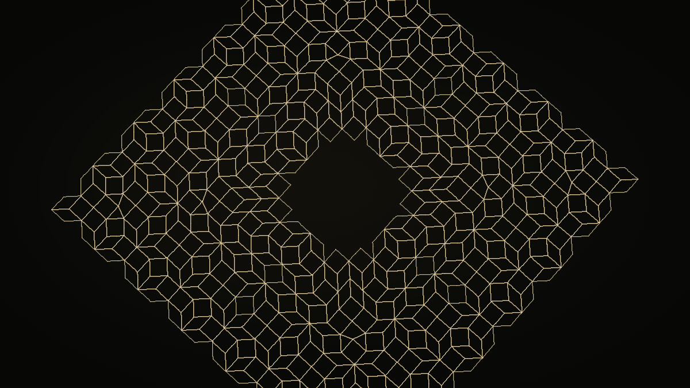

<h1 align="center">Muqarnas</h1>

<p align="center"><strong>The vault from its plan</strong></p>

<p align="center">
  <a href="https://github.com/Jameel7007/muqarnas/actions/workflows/ci.yml"></a>
  <a href="LICENSE"></a>
  <a href="LICENSE-CONTENT"></a>
  <a href="CITATION.cff"></a>
</p>

<p align="center">
  A computational reconstruction of a thirteenth-century muqarnas vault from its
  two-dimensional plan.
</p>

<p align="center">
  <a href="https://jameel7007.github.io/muqarnas/"><strong>Experience the reconstruction →</strong></a>
</p>

<p align="center">
  <a href="https://jameel7007.github.io/muqarnas/">
    
  </a>
</p>

<p align="center">
  <strong>632 generated elements</strong><br />
  Exact ℚ(√2) geometry → construction plan → architectural lift → watertight mesh → real-time WebGPU
</p>

## The idea

A drawing is not a building. The gypsum plate found at Takht-i Sulaymān records
a muqarnas from above, but its lines do not uniquely determine how the cells were
stacked in space.

This project asks: **how much architectural information survives when a
three-dimensional muqarnas vault is reduced to a two-dimensional plan?** It draws
the plan, solves structurally valid tier assignments, and raises two different
vaults from the same projection in a scroll-driven Three.js/WebGPU experience.

## What makes this different

No geometry is traced: every element is constructed computationally from a
historical alphabet using exact arithmetic over ℚ(√2). The Takht-i Sulaymān
plate's *arrangement* — which element sits where, at what orientation — is
digitized from the vector line work of Harmsen's fig. 5.17(a) and regularized
onto the lattice, then stored as kind + isometry rather than as vertices, so the
library still constructs every outline itself. The regularized
quarter contains 157 elements; four rotations and four seam diamonds produce the
632-element full plan. Tiling closure and projection identity are therefore tested
with equality rather than epsilon tolerances.

The resulting plan is lifted tier by tier into curved, watertight geometry using
an al-Kāshī-informed profile. Tests cover the exact plan arithmetic, solver reach,
mesh and ambient-occlusion invariants, paint frames, and scene transitions.

## The reconstruction

The source is a thirteenth-century gypsum plate drawing from the Ilkhanid palace
at Takht-i Sulaymān. The vault itself does not survive, and no corresponding built
vault is known: the superstructure shown here is a computational reconstruction,
not an archaeological record.

The solver finds four readings in the corner-starting family associated with
Harb; the site stages two of them to show that one plan can support more than one
architectural interpretation. The polychromy is historically plausible but not
documented for this lost vault.

## How it works

```text
element alphabet → exact quarter-plan → 632-element full plan
                 → tier solver → curved lift → baked geometry and AO
                 → Three.js/WebGPU stage → scroll choreography
```

- **Plan** — constructs the element alphabet and Takht-i Sulaymān plan in exact
  ℚ(√2) arithmetic.
- **Lift** — searches valid tier assignments and turns a reading into curved,
  watertight three-dimensional geometry.
- **Render** — derives the plaster, glaze, ornament, gilt, lighting, and baked
  ambient occlusion used by the WebGPU stage.
- **Scenes** — carries the plan through nine scroll-driven scenes, an introduction,
  and a free-look coda.

## Mathematics

Coordinates live in the module
`(ℤ + ℤ·√2/2)²`, following the element formalism developed for the plate. The
vertical profile follows al-Kāshī's construction, and his *taʿdīl* coefficient
turns facet-base lengths into surface area. The historical derivation and the
small discrepancy in the manuscript value are documented in the
[scholarly notes](https://jameel7007.github.io/muqarnas/about.html).

## Architecture

| Package | Responsibility |
| --- | --- |
| [`packages/plan`](packages/plan) | Exact 2D geometry, element alphabet, tiling, and plate construction |
| [`packages/lift`](packages/lift) | Tier-assignment solver and curved vault mesh |
| [`packages/render`](packages/render) | Three.js/WebGPU geometry, TSL materials, AO, paint, and lighting |
| [`packages/scenes`](packages/scenes) | GSAP ScrollTrigger choreography and transitions |
| [`site`](site) | The public piece and inspection harnesses |

Primary and secondary sources are listed in [`docs/SOURCES.md`](docs/SOURCES.md).
[`docs/SPEC.md`](docs/SPEC.md) is the original build brief, kept as written and
dated; where the shipped work diverges from it, the repository is authoritative.

## Findings

The digitization produced one result worth stating on its own. Taken as regular
elements, the plate's quarter design spans exactly **7 + 3.5√2 ≈ 11.9497
modules**, while its drawn field is an integer **12**. The semi-regular figures
that Dold-Samplonius and Harmsen noted along the diagonal therefore absorb
exactly **Δ = 5 − 3.5√2 ≈ 0.0503 modules — about 1.8 mm** at the plate's 3.5 cm
module. The irregularity is not free-hand error: 29 of 156 faces resist
classification as regular elements, and shortening one band by exactly Δ
resolves 28 of them.

→ [**A misfit of 5 − 3.5√2 in the Takht-i Sulaymān plate**](docs/notes/plate-misfit.md)

## Provenance and reproducibility

Source scans stay local and are never committed. So that the one digitized
input remains checkable, the lattice-snapped line segments the digitizer read
are published as [`docs/data/takht-plate-segments.json`](docs/data/takht-plate-segments.json)
— exact `a + b·(√2/2)` coordinates, measurements rather than the figure itself.
The generated placements can therefore be regenerated with no scan present:

```bash
node tools/digitize-plate.mjs docs/data/takht-plate-segments.json \
  packages/plan/src/takht-plate-data.ts
```

CI runs exactly this on every push and fails if the result differs by a byte,
so the published provenance cannot drift from the data the site is built from.

## Licence and citation

The code is [MIT](LICENSE). The writing, visuals, and data are
[CC BY 4.0](LICENSE-CONTENT). If you use the reconstruction or its findings,
please cite it — [`CITATION.cff`](CITATION.cff) has the metadata, and GitHub's
“Cite this repository” button will format it for you. The scholarship this work
builds on belongs to its authors and is cited in `docs/SOURCES.md`.

## Run locally

```bash
npm install
npm test
npm run typecheck
npm run dev
```

The development server opens on <http://localhost:5175>. WebGPU is used when
available, with Three.js handling the rendering backend.
